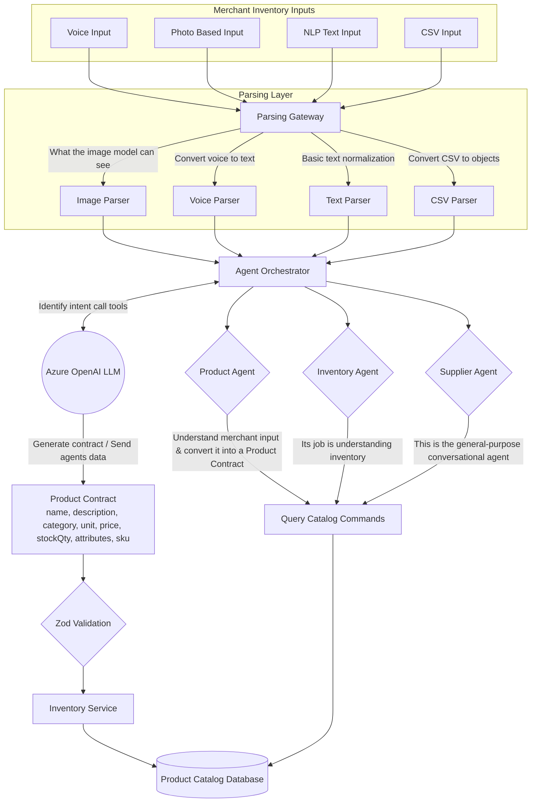
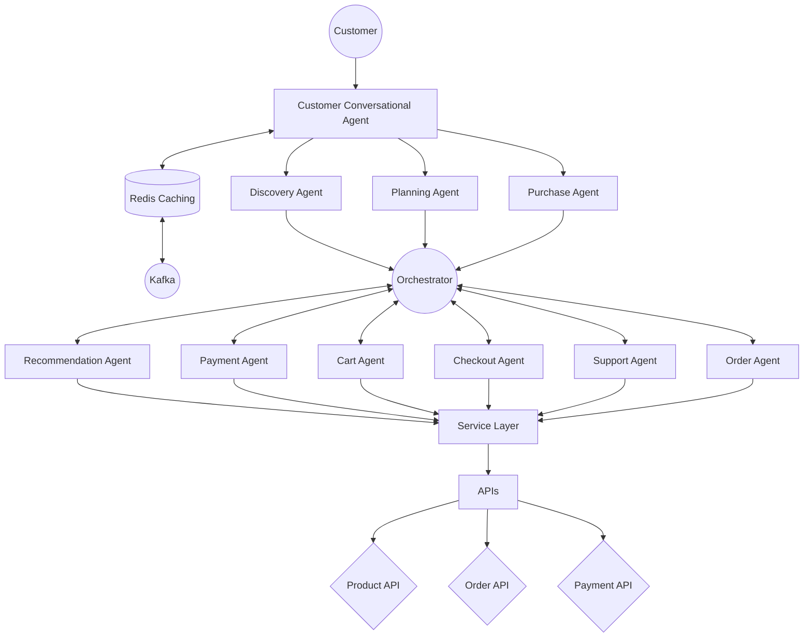
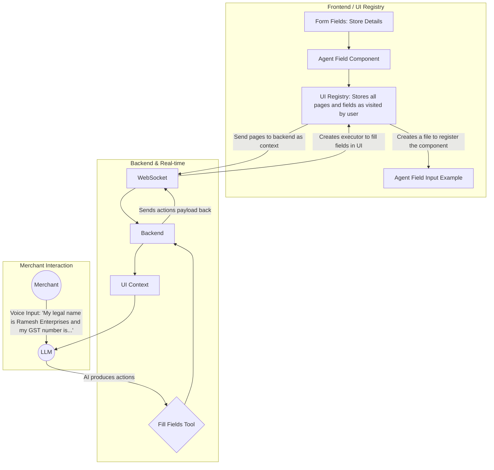

# Baazar AI Agent Architecture

Baazar uses a central **Merchant Orchestrator** that understands user intent and routes requests to specialized agents. The system is designed to handle multiple input modalities, coordinate complex multi-agent interactions on both the merchant and customer sides, and keep the user interface synchronized in real-time.

---

## 1. Merchant Agent Orchestration

Merchants can interact with the system using Voice, Photo, Text, or CSV inputs. These inputs are parsed by a dedicated Parsing Layer before being handed off to the Agent Orchestrator. The Orchestrator uses Azure OpenAI to identify intent, formulate a structured "Product Contract", and delegate execution to the appropriate specialized agent.

---

## 2. Customer Conversational Architecture

On the customer side, the interactions are managed by a **Customer Conversational Agent** which caches data via Redis and coordinates distributed events via Kafka. The conversational agent fans out to discovery, planning, and purchase agents, which then connect back to the core orchestrator.

---

## 3. Dynamic UI & Context Synchronization

Baazar heavily relies on a dynamic, AI-driven UI. The UI Registry on the frontend stores all pages and fields visited by the user. When a merchant provides an instruction (like filling out a form via voice), the UI context is sent over WebSockets to the backend, enabling the AI to directly fill in the corresponding fields on the merchant's screen.

---

## Core Agents Breakdown

| Agent                | Responsibility              |
| -------------------- | --------------------------- |
| **Product Agent**    | Product catalog management  |
| **Inventory Agent**  | Stock tracking & updates    |
| **Supplier Agent**   | Suppliers & purchase orders |
| **Growth Agent**     | Promotions, upselling & POS |
| **Onboarding Agent** | Merchant/store setup        |
